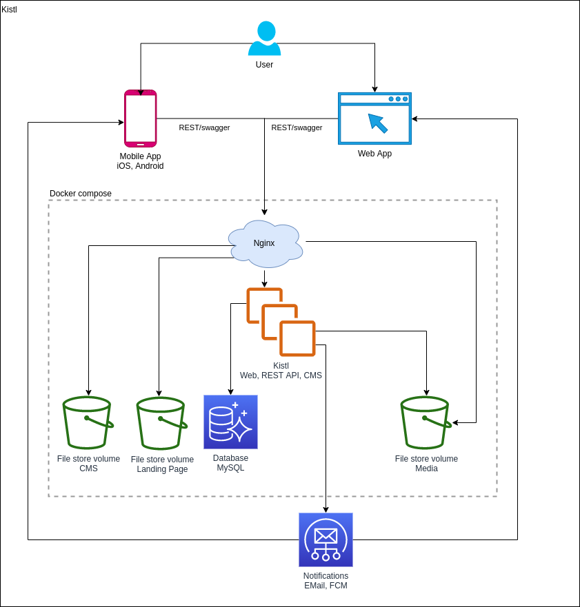
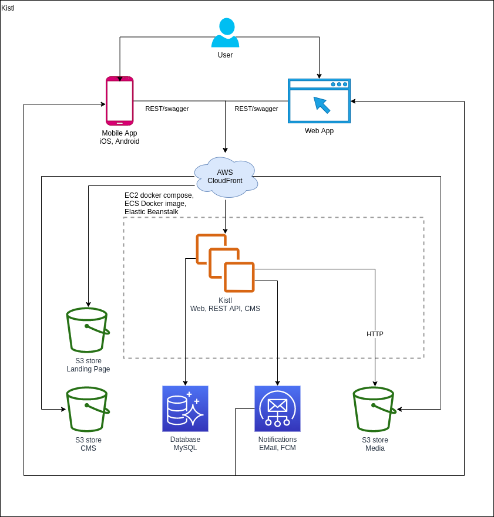

# Kistl

## Architecture

App schema - Docker compose



App schema - AWS



## API

TSOA documentation <https://tsoa-community.github.io/docs/>

## Features

- TSOA template with Express
- Swagger UI
- Supported authentication
  - ApiKey
  - BasicAuth
  - JWT
- Role-based access control
- Loading auth from static conf or from DB
- Automatically rebuild on code change

## Development

```sh
npm install
npm run dev
open http://localhost:3000
```

## Production

```sh
npm install
npm run build
npm start
```
